= MongoDB to Iceberg simple demonstration
'''

Version : 1.0.0 + date : 2025/06/19 +

'''

== Introduction

This github repository show a simple collection migration from MongoDB to a Iceberg Lakehouse
using Dremio for the ingestion.

== Pre-requisites

. Laptop with a Linux, Windows or Macbook.
. A modern browser.
. Wifi Internet connection.
. Git installed.
. https://www.docker.com/products/docker-desktop/[Docker Destop] or https://podman-desktop.io/[Podman Desktop] installed

== Step 1: Get github project

{blank}

You can use the workshop project cloning this github repository : https://github.com/bguedes/mongo2iceberg-dremio.git[Demo github repo]

[,console]
----
git clone https://github.com/bguedes/mongo2iceberg-dremio.git
----

== Step 2: Setup environment

=== Launch everything

[,console]
----
docker-compose up
----

For podman desktop launch :
[,console]
----
podman compose up
----

If everything goes well you should see the following result in your console:

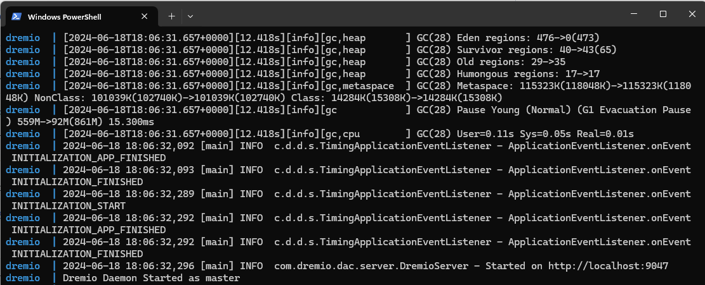

{blank}

=== Dremio

Please signup to your http://localhost:9047/signup[dremio cluster] :

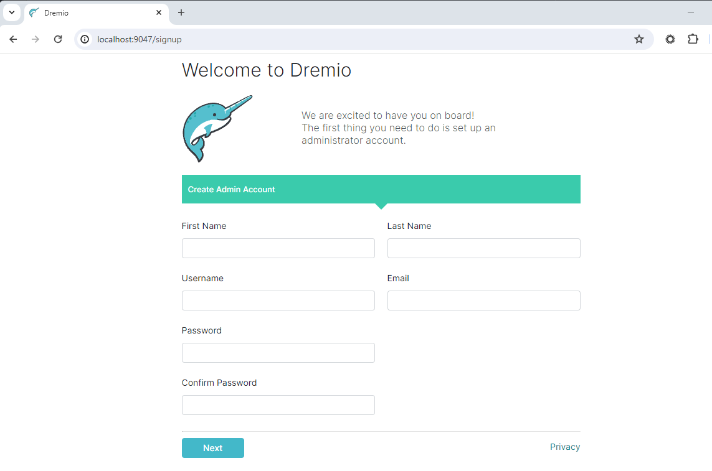

{blank}

After this step, you will get Dremio setup and running :

image::images/dremio-after-signup.png[]

=== Minio

{blank}

We need to setup minio for the demo, follow this http://localhost:9001/login[link], use these parameters :

____
login : admin
____
____
password : password
____

{blank}

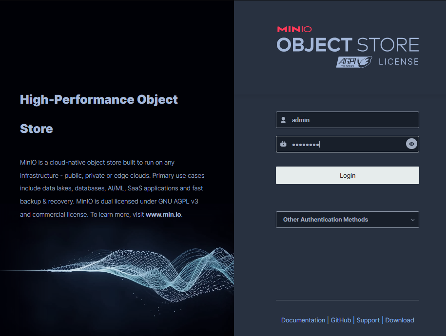

{blank}

Let's create a minio bucket called warehouse :

{blank}

image::images/minio-createbucket1.png[]

{blank}

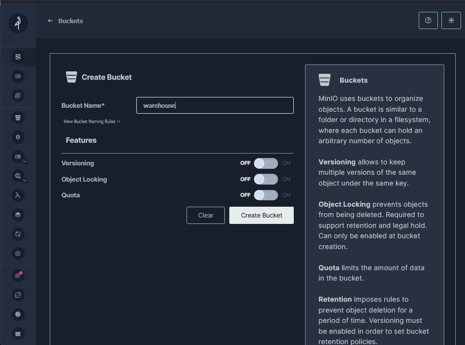

{blank}

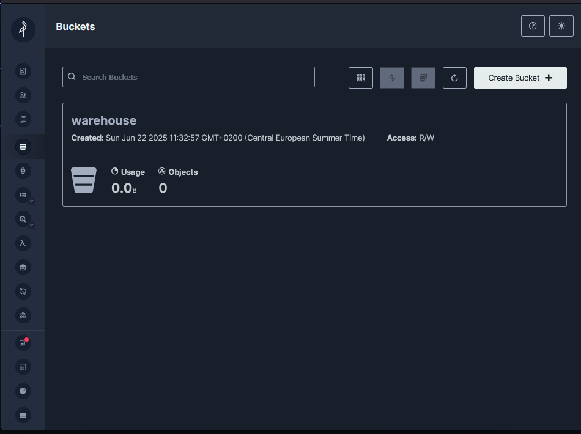

{blank}

=== Create a Nessie Datasource

Now that our minio is configured, we are going to create a S3 compatible datasource.
On dremio UI choose 'Add source' :

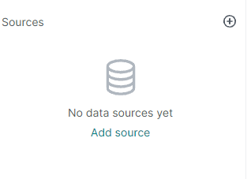

Choose Amazon S3 data source from the list :

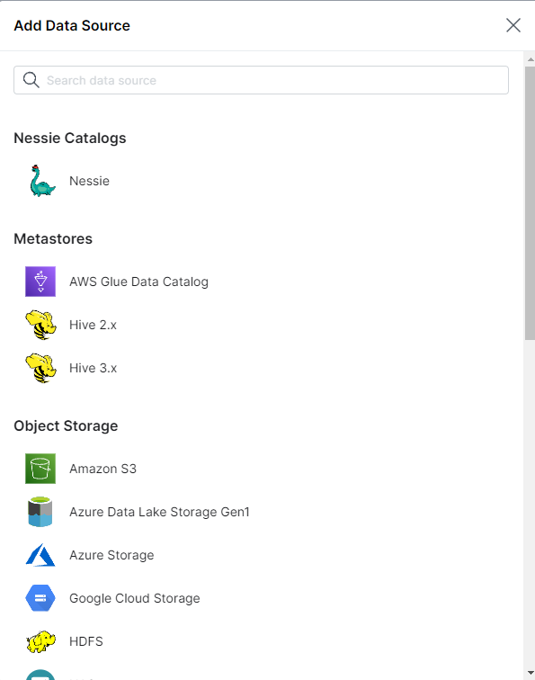

In Source Setting -> General :

____
Name : nessie
____
____
Nessie Endpoint URL : http://nessie:19120/api/v2
____

{blank}

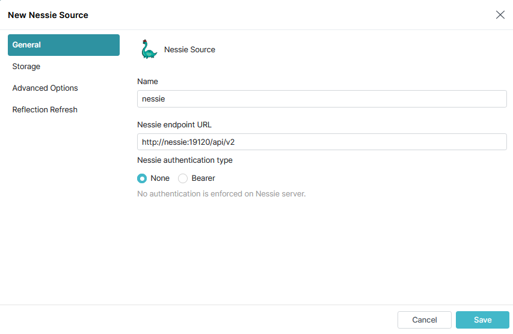

In Source Setting -> Storage :
____
AWS Root Path : warehouse
____
____
AWS Access Key : admin
____
____
AWS Secret Key : password
____

{blank}

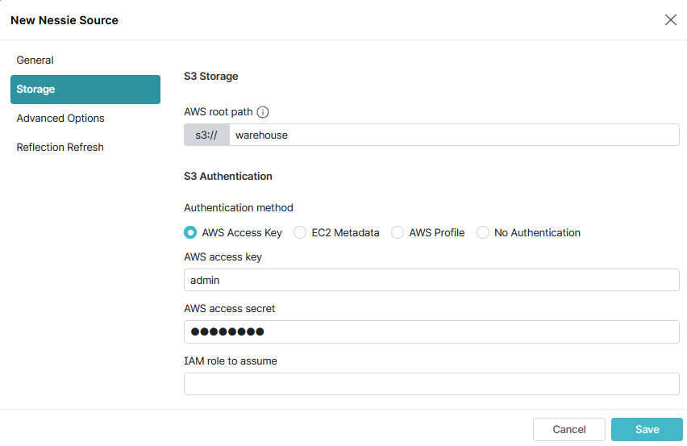

{blank}

Add these properties :

____
Name: fs.s3a.path.style.access | Value: true
____
____
Name: fs.s3a.endpoint | Value: minio:9000
____
____
Name: dremio.s3.compat | Value: true
____

Uncheck “Encrypt Connection” Box 

{blank}

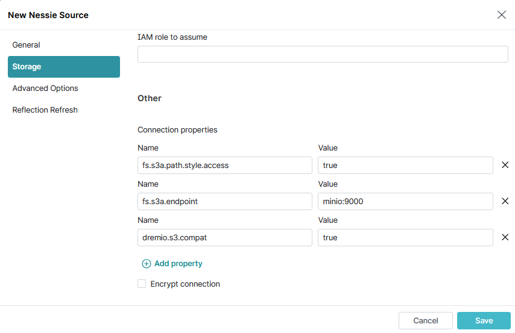

{blank}

== Step 3: Setup MongoDB

create a S3 compatible datasource.
On dremio UI choose 'Add source' and choose MongoDB :

{blank}

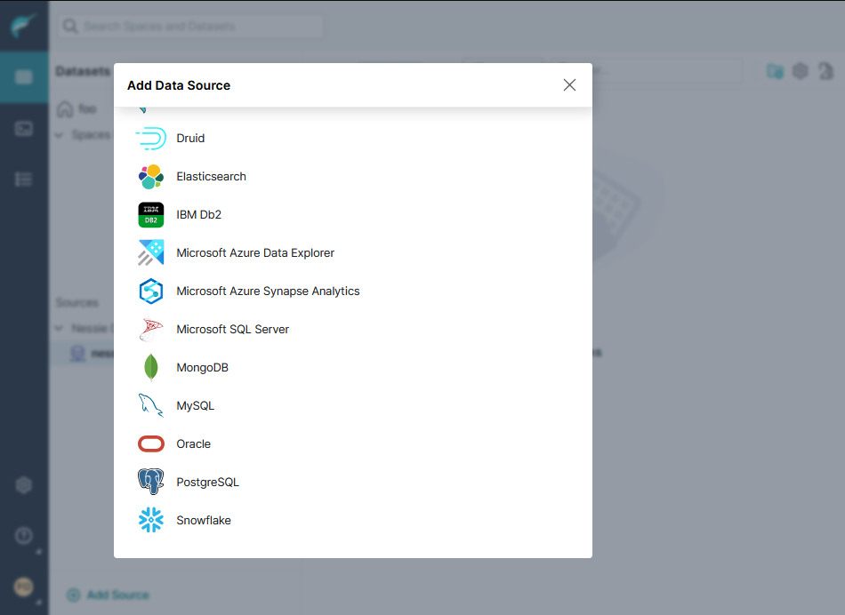

{blank}

Mongodb data source setup :

{blank}
____
Name: mongodb
____
____
Host: mongodb
____
____
Port: 27017
____
____
Username: root
____
____
Password: mongodb
____
____
Authentication Database: admin
____

{blank}

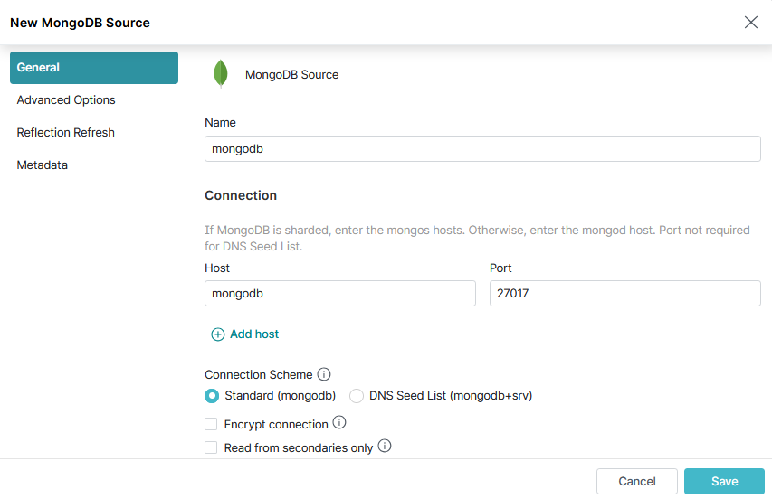

{blank}

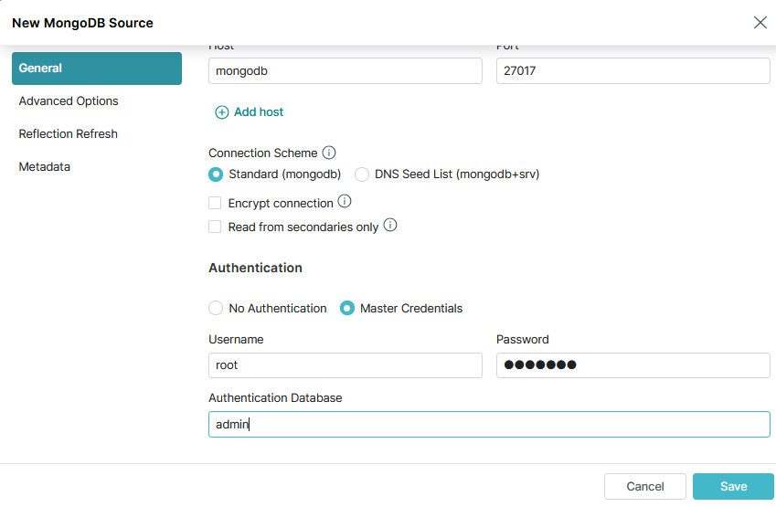

{blank}

Let's connect to the database :

[,console]
----
docker exec -it mongodb mongosh -u root -p mongodb --authenticationDatabase admin
----

{blank}

[,javascript]
----
use productsDB;

db.createCollection("products");

db.products.insertMany([
    { RecordID: 1, ProductID: 101, Category: "Category A", weight: 100, color: "red", DateRecorded: "2023-01-01" },
    { RecordID: 2, ProductID: 102, Category: "Category B", weight: 150, color: "white", DateRecorded: "2023-01-02" },
    { RecordID: 3, ProductID: 103, Category: "Category C", weight: 200, color: "blue", DateRecorded: "2023-01-03" },
    { RecordID: 4, ProductID: 104, Category: "Category A", weight: 110, color: "magenta", DateRecorded: "2023-01-04" },
    { RecordID: 5, ProductID: 105, Category: "Category B", weight: 120, color: "red", DateRecorded: "2023-01-05" },
    { RecordID: 6, ProductID: 106, Category: "Category C", weight: 130, color: "yellow", DateRecorded: "2023-01-06" },
    { RecordID: 7, ProductID: 107, Category: "Category A", weight: 140, color: "white", DateRecorded: "2023-01-07" },
    { RecordID: 8, ProductID: 108, Category: "Category B", weight: 160, color: "brown", DateRecorded: "2023-01-08" },
    { RecordID: 9, ProductID: 109, Category: "Category C", weight: 170, color: "black", DateRecorded: "2023-01-09" },
    { RecordID: 10, ProductID: 110, Category: "Category A", weight: 180, color: "white", DateRecorded: "2023-01-10" }
]);
----
{blank}

Now 10 products have been iserted to MongoDB, let's copy them to a Iceberg repository.

== Step 5: Manipulating Iceberg Table

{blank}

[,sql]
----

-- Select all products on MongoDB database
SELECT * FROM mongodb.productsDB.products;

-- Create a Nessie Iceberg catalog for products
CREATE TABLE nessie.products AS SELECT * FROM mongodb.productsDB.products;

-- Check the max product id that has ben inserted in MongoDB (record 10)
SELECT COALESCE(MAX(RecordID), 0) FROM mongodb.productsDB.products;

-- Insert products from MongoDB to Iceberg using the Nessie catalog
INSERT INTO nessie.products
SELECT *
FROM mongodb.productsDB.products
WHERE RecordID > (SELECT COALESCE(MAX(RecordID), 0) FROM mongodb.productsDB.products);

-- Select products on Iceberg usng Nessie products catalog
select * from nessie.products AT BRANCH "main";
----
{blank}

You will get this result:

{blank}

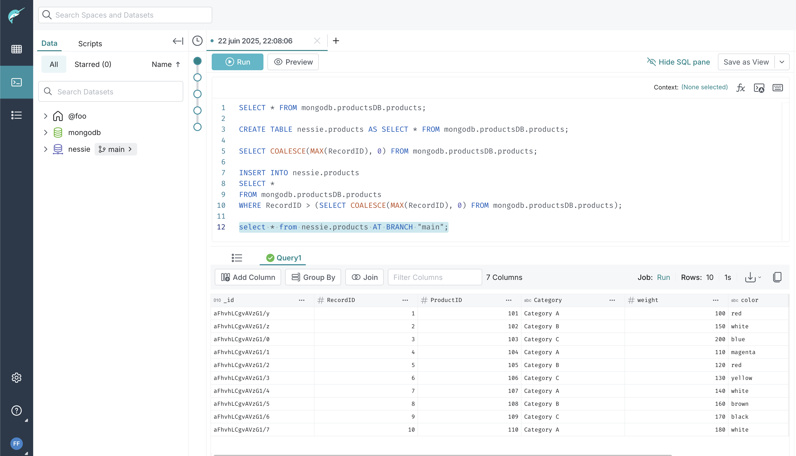

Now if we change the products mongodb structure, what will be the impact for Iceberg ?

Let say that adding a new product, I'm specifying his price.
In my mongoshell le's add this product:

[,javascript]
----
db.products.insertMany([
{ 
  RecordID: 20, 
  ProductID: 300, 
  Category: "Category A", 
  weight: 180, 
  color: "white", 
  price: 350,
  DateRecorded: "2023-01-10" 
}
]);
----

Now in the dremio SQL Runner let's insert this document into Iceberg:

[,sql]
----
-- Insert products from MongoDB to Iceberg using the Nessie catalog
INSERT INTO nessie.products
SELECT *
FROM mongodb.productsDB.products
WHERE RecordID > (SELECT COALESCE(MAX(RecordID), 0) FROM mongodb.productsDB.products);
----

[,javascript]
----
db.dashboardData.insertMany([{ RecordID: 20,
Category: ["Category A", "Category B", "Category C"],
Value: {
firstname: "Bruno",
lastname: "Guedes"
},
DateRecorded: "2023-01-01" }]);

db.dashboardData.insertMany([{ RecordID: 10,
Category: ["Category A", "Category B", "Category C"],
Value: {
firstname: "Bruno",
lastname: "Guedes"
},
DateRecorded: "2023-01-01" }]);

db.dashboardData.insertMany([{
...     { RecordID: 30, Category: "Category B", Value: 150, DateRecorded: "2023-01-02" },
...     { RecordID: 31, Category: "Category C", Value: 200, DateRecorded: "2023-01-03" },
...     { RecordID: 32, Category: "Category A", Value: 110, DateRecorded: "2023-01-04" },
...     { RecordID: 33, Category: "Category B", Value: 120, DateRecorded: "2023-01-05" },
}]);

db.dashboardData.insertMany([{ RecordID: 60,
Category: ["Category A", "Category B", "Category C"],
Value: {
firstname: "Bruno",
lastname: "Guedes"
},
more: true,
DateRecorded: "2023-01-01" }]);
----
