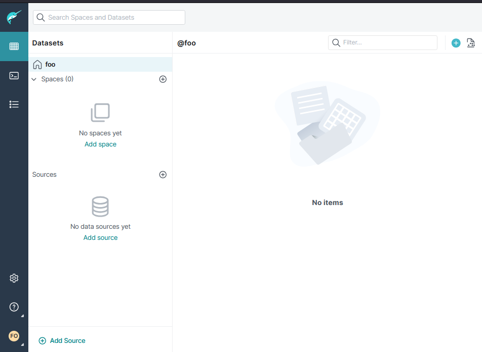
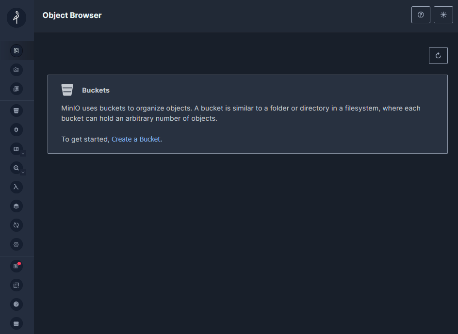

= MongoDB to Iceberg simple demonstration
'''

Version : 1.0.0 + date : 2025/06/19 +

'''

== Introduction

This github repository show a simple collection migration from MongoDB to a Iceberg Lakehouse
using Dremio for the ingestion.

== Pre-requisites

. Laptop with a Linux, Windows or Macbook.
. A modern browser.
. Wifi Internet connection.
. Git installed.
. https://www.docker.com/products/docker-desktop/[Docker Destop] or https://podman-desktop.io/[Podman Desktop] installed

== Step 1: Get github project

{blank}

You can use the workshop project cloning this github repository : https://github.com/bguedes/mongo2iceberg-dremio.git[Demo github repo]

[,console]
----
git clone https://github.com/bguedes/mongo2iceberg-dremio.git
----

== Step 2: Setup environment

=== Launch everything

[,console]
----
docker-compose up
----

For podman desktop launch :
[,console]
----
podman compose up
----

If everything goes well you should see the following result in your console:

image::images/dremio-setup-ok.png[]

{blank}

=== Dremio

Please signup to your http://localhost:9047/signup[dremio cluster] :

{blank}

After this step, you will get Dremio setup and running :

=== Minio

{blank}

We need to setup minio for the demo, follow this http://localhost:9001/login[link], use these parameters :

____
login : admin
____
____
password : password
____

{blank}

{blank}

Let's create a minio bucket called warehouse :

{blank}

{blank}

image::images/minio-createbucket2.png[]

{blank}

{blank}

=== Create a Nessie Datasource

Now that our minio is configured, we are going to create a S3 compatible datasource.
On dremio UI choose 'Add source' :

Choose Amazon S3 data source from the list :

In Source Setting -> General :

____
Name : nessie
____
____
Nessie Endpoint URL : http://nessie:19120/api/v2
____

{blank}

image::images/nessie-config1.png[]

In Source Setting -> Storage :
____
AWS Root Path : warehouse
____
____
AWS Access Key : admin
____
____
AWS Secret Key : password
____

{blank}

image::images/nessie-config2.png[]

{blank}

Add these properties :

____
Name: fs.s3a.path.style.access | Value: true
____
____
Name: fs.s3a.endpoint | Value: minio:9000
____
____
Name: dremio.s3.compat | Value: true
____

Uncheck “Encrypt Connection” Box 

{blank}

image::images/nessie-config3.png[]

{blank}

== Step 3: Setup MongoDB

create a S3 compatible datasource.
On dremio UI choose 'Add source' and choose MongoDB :

{blank}

{blank}

Mongodb data source setup :

{blank}
____
Name: mongodb
____
____
Host: mongodb
____
____
Port: 27017
____
____
Username: root
____
____
Password: mongodb
____
____
Authentication Database: admin
____

{blank}

{blank}

{blank}

Let's connect to the database :

[,console]
----
docker exec -it mongodb mongosh -u root -p mongodb --authenticationDatabase admin
----

{blank}

[,sql]
----
use productsDB;

db.createCollection("products");

db.products.insertMany([
    { RecordID: 1, ProductID: 101, Category: "Category A", weight: 100, color: "red", DateRecorded: "2023-01-01" },
    { RecordID: 2, ProductID: 102, Category: "Category B", weight: 150, color: "white", DateRecorded: "2023-01-02" },
    { RecordID: 3, ProductID: 103, Category: "Category C", weight: 200, color: "blue", DateRecorded: "2023-01-03" },
    { RecordID: 4, ProductID: 104, Category: "Category A", weight: 110, color: "magenta", DateRecorded: "2023-01-04" },
    { RecordID: 5, ProductID: 105, Category: "Category B", weight: 120, color: "red", DateRecorded: "2023-01-05" },
    { RecordID: 6, ProductID: 106, Category: "Category C", weight: 130, color: "yellow", DateRecorded: "2023-01-06" },
    { RecordID: 7, ProductID: 107, Category: "Category A", weight: 140, color: "white", DateRecorded: "2023-01-07" },
    { RecordID: 8, ProductID: 108, Category: "Category B", weight: 160, color: "brown", DateRecorded: "2023-01-08" },
    { RecordID: 9, ProductID: 109, Category: "Category C", weight: 170, color: "black", DateRecorded: "2023-01-09" },
    { RecordID: 10, ProductID: 110, Category: "Category A", weight: 180, color: "white", DateRecorded: "2023-01-10" }
]);
----
{blank}

== Step 5: Manipulating Iceberg Table

{blank}

[,sql]
----
-- Dropping Iceber Table
drop table if exists minio.trips;

-- Creating Iceber Table
CREATE TABLE minio.trips (
	ts BIGINT,
	uuid VARCHAR,
	rider VARCHAR,
	driver VARCHAR,
	fare FLOAT,
	city VARCHAR
) PARTITION BY(city);

-- Populate the Iceberg Table
insert into minio.trips values(1695159649087, '863fee31-8ddc-43e9-9b2a-363401dca1fa', 'rider-A', 'driver-K', 40.10, 'san_francisco');
insert into minio.trips values(1695516137016, '214fee1f-0683-4eb9-8e04-e19afc9c6d2f', 'rider-F', 'driver-P', 24.50, 'sao_paulo');
insert into minio.trips values(1695115999911, 'f26ceba0-421b-40ab-8423-b061dc258f81', 'rider-J', 'driver-T', 32.10, 'paris');

-- Check the content
SELECT * from minio.trips;

-- Let's change the Partition by driver
ALTER TABLE minio.trips DROP PARTITION FIELD city;
ALTER TABLE minio.trips ADD PARTITION FIELD driver;

-- Insert new datas
insert into minio.trips values(1695159649087, '9eb8d6c2-08d0-4228-b126-13422159e07a', 'rider-C', 'driver-Q', 25.50, 'san_francisco');
insert into minio.trips values(1695516137016, 'e25750a8-30f1-48bb-9f47-0bff2a1f8bbc', 'rider-G', 'driver-V', 10.50, 'sao_paulo');
insert into minio.trips values(1695115999911, 'bb198f24-90f2-4b8a-8694-f0a58507e3f1', 'rider-H', 'driver-M', 24.30, 'paris');

-- Check the content
SELECT * from minio.trips;

select * from TABLE(table_history('minio.trips' ))
order by 1 desc;

select * from minio.trips at timestamp '2024-06-26 22:19:53.729';

-- Adding a column
ALTER TABLE minio.trips ADD COLUMNS (currency VARCHAR);

-- Insert new datas with currency values
insert into minio.trips values(1695159649087, '491eb0eb-93f6-4f58-94e2-151d94459a57', 'rider-D', 'driver-F', 15.50, 'paris', 'EUR');
insert into minio.trips values(1695516137016, '0be814c3-9e6e-40bb-bdb9-cc2da6a86bdb', 'rider-E', 'driver-G', 20.50, 'paris' , 'EUR');

-- Dropping currency column
ALTER TABLE minio.trips DROP COLUMN currency;
----

{blank}

[,sql]
----
SELECT * FROM mongodb.productsDB.products;

CREATE TABLE nessie.products AS SELECT * FROM mongodb.productsDB.products;

SELECT COALESCE(MAX(RecordID), 0) FROM mongodb.productsDB.products;

INSERT INTO nessie.products
SELECT *
FROM mongodb.productsDB.products
WHERE RecordID >= (SELECT COALESCE(MAX(RecordID), 0) FROM mongodb.productsDB.products);

select * from nessie.products AT BRANCH "main";
----

[,javascript]
----
db.dashboardData.insertMany([{ RecordID: 20,
Category: ["Category A", "Category B", "Category C"],
Value: {
firstname: "Bruno",
lastname: "Guedes"
},
DateRecorded: "2023-01-01" }]);

db.dashboardData.insertMany([{ RecordID: 10,
Category: ["Category A", "Category B", "Category C"],
Value: {
firstname: "Bruno",
lastname: "Guedes"
},
DateRecorded: "2023-01-01" }]);

db.dashboardData.insertMany([{
...     { RecordID: 30, Category: "Category B", Value: 150, DateRecorded: "2023-01-02" },
...     { RecordID: 31, Category: "Category C", Value: 200, DateRecorded: "2023-01-03" },
...     { RecordID: 32, Category: "Category A", Value: 110, DateRecorded: "2023-01-04" },
...     { RecordID: 33, Category: "Category B", Value: 120, DateRecorded: "2023-01-05" },
}]);

db.dashboardData.insertMany([{ RecordID: 60,
Category: ["Category A", "Category B", "Category C"],
Value: {
firstname: "Bruno",
lastname: "Guedes"
},
more: true,
DateRecorded: "2023-01-01" }]);
----
